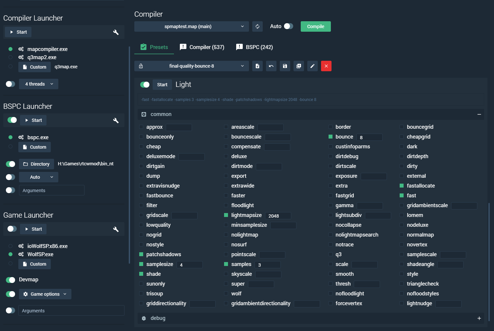
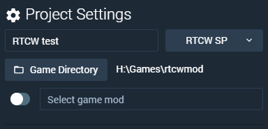
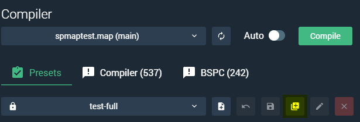
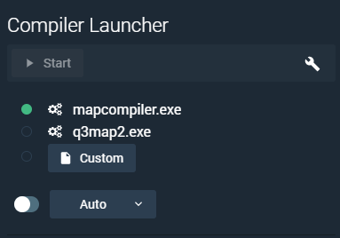
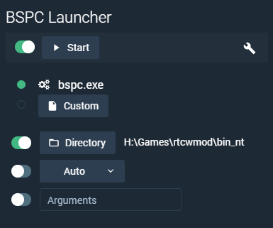
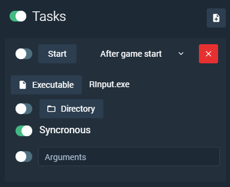

# Q3 Map Compiler UI Guide

A brief how-to.

## Projects
Start by creating a new project, you can have unlimited number of projects, each project can have unique properties like game, game directory, game mod, project name, selected map and compiler preset. Click on the name of the created project to open it up.

## Project Settings

Inside the project window, you can edit the project settings. To make use of compiler and launchers, the game and game directory should be set. Afterwards you should be able to select the map and the compiler preset. 

## Compiler Panel

You can chose the predefined and custom presets (created by user). You cannot modify the predefined presets (these are marked with the closed lock icon) unlike the custom ones, but you can always base your custom preset on the predefined one by coping it using `Copy` button.

## Compiler Launcher

* Next the map compiler should be selected. The application is shipped with:
	* custom `NetRadiant Q3Map2` (map-compiler)
	* vanilla `Q3map2 2.5.17` (which ships with GtkRadiant 1.6.*).   
	* You can also select a custom compiler by click on `Custom` button. 
* You can run the compiler launcher without triggering the other launchers by pressing the `Start` button, however this will trigger the dependent enabled tasks.

## BSPC Launcher

* If the selected game supports BSPC, the BSPC launcher will be available. You can either select the custom executable, or select the directory which contains the executable, it will automatically add BSPC executable to the list. 
* The directory also defines the `working directory` for the executable, which is useful in cases where you need to make use of additional configuration files needed by BSPC. 
* If directory is not selected, the working directory will be deduced from the selected custom executable.  
* You can enable/disable the launcher to be run on each compilation process by toggling the switch near the `Start` button.
* Arguments support variable strings, that can be passed to the BSPC executable: 
	* `$map` contains map name without extension
	* `$mapPath` contains absolute path to the map file

## Game Launcher

* Game launcher is used to quickly test maps with defined options. The supported game engines are deduced from the selected game directory in the project settings panel. You can also select custom engine using `Custom` button.  
* You can enable/disable the launcher, to be run on each compilation process, by toggling the switch near the `Start` button. 
* `Game Options` list allows you to quickly toggle certain cvar values that are passed to the game upon start.  
* Having the game launcher enabled would automatically restart the map after each compilation process.

## Tasks

* Tasks allows you create arbitrary amount of tasks that will run upon specified event. 
* You can toggle the task from the run by clicking on the switch near the `Start` button. 
* The directory button specified the `working directory` for the running task.  
* Arguments support variable strings, that can be passed to the application or script: 
	* `$map` contains map name without extension
	* `$mapPath` contains absolute path to the map file
* You can separately run tasks by clicking the `Start` button.

## Compiling

* Once everything is set up, press the `Compile` button in `Compiler` section. 
* You can click the `Auto` switch to enable auto compilation on each map save.

* Output should be written into the `Compiler` output tab, which is near the `Presets` button. Any BSPC output will respectively go into `BSPC` tab.  
